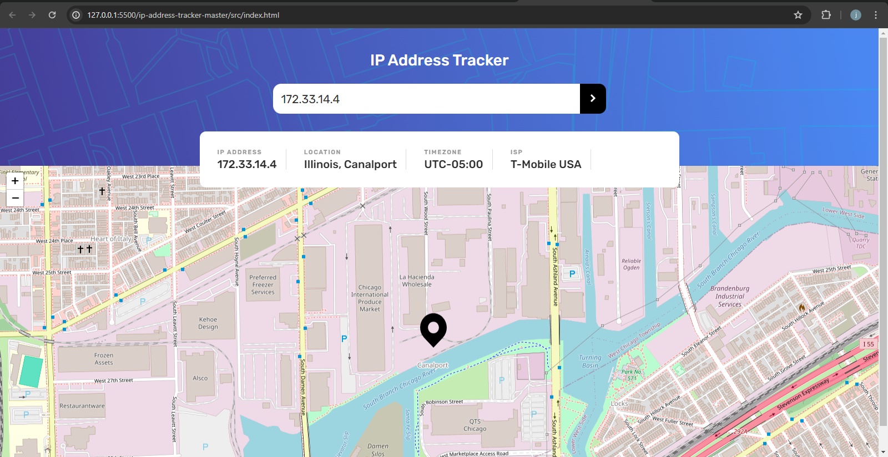
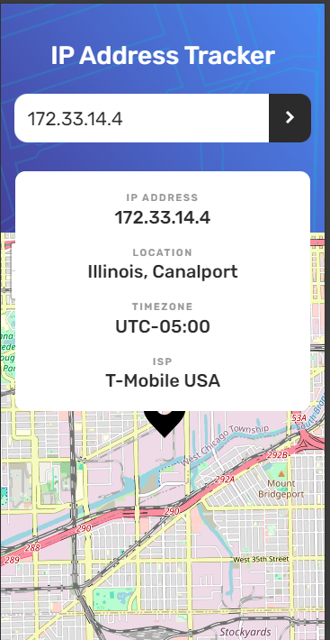
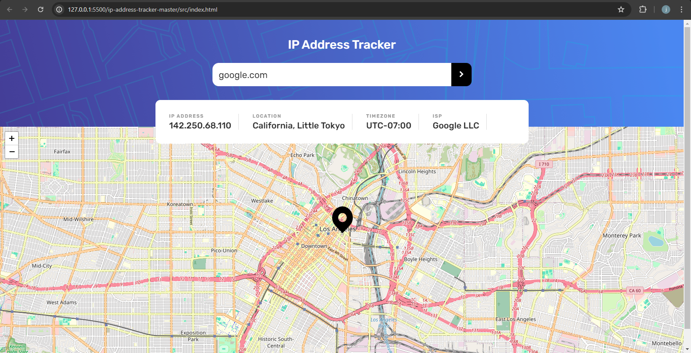
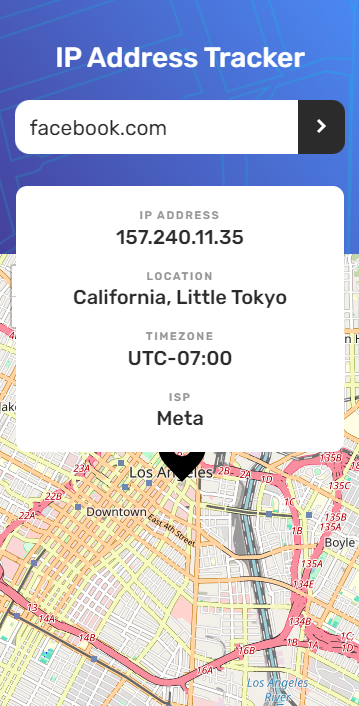

# Frontend Mentor - IP address tracker solution

This is a solution to the [IP address tracker challenge on Frontend Mentor](https://www.frontendmentor.io/challenges/ip-address-tracker-I8-0yYAH0). 
## Table of contents

- [Overview](#overview)
  - [The challenge](#the-challenge)
  - [Screenshot](#screenshot)
  - [Links](#links)
- [My process](#my-process)
  - [Built with](#built-with)

## Overview

### The challenge

Users should be able to:

- View the optimal layout for each page depending on their device's screen size
- See hover states for all interactive elements on the page
- See their own IP address on the map on the initial page load
- Search for any IP addresses or domains and see the key information and location

### Screenshot

### Links

- Solution URL: [https://github.com/chibuzorEbede/frontend-mentor-project-solutions/tree/main/ip-address-tracker-master](https://github.com/chibuzorEbede/frontend-mentor-project-solutions/tree/main/ip-address-tracker-master)
- Live Site URL: [https://frontend-mentor-project-solutions.vercel.app/](https://frontend-mentor-project-solutions.vercel.app/)

## My process

- I used vanilla JS for this project to test out my ability to build without a framework
- I initially wrote the HTML and CSS then incrementally added the Javascript

### Built with

- Semantic HTML5 markup
- CSS custom properties
- Flexbox
- CSS Grid
- Mobile-first workflow
- Vanilla JS library

I've just completed a front-end coding challenge from @frontendmentor! 🎉

You can see my solution here: https://www.frontendmentor.io/solutions/ip-address-tracker-sKxaDBbZAt

Any suggestions on how I can improve are welcome!